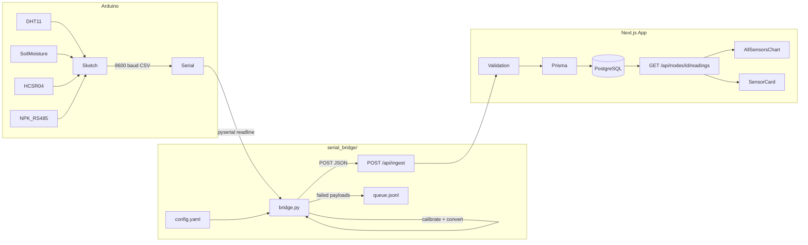

# Design Document: Arduino Sensor Integration

## Overview

This feature extends the AquaSense smart irrigation dashboard to ingest data from a physical Arduino sensor node. The Arduino reads four sensors (DHT11, soil moisture, HC-SR04 ultrasonic, NPK via RS485) and transmits a single CSV line per cycle over serial at 9600 baud. A Python serial bridge script reads that line, converts raw ADC values and hex NPK bytes to engineering units, applies calibration, and POSTs a JSON payload to the existing `POST /api/ingest` endpoint. The Prisma schema gains three nullable float columns (`nitrogen`, `phosphorus`, `potassium`) on `SensorReading`. The `AllSensorsChart` component is updated to render all seven series. `SensorCard` gains NPK display rows. A simulation mode in the bridge generates synthetic readings at high rate to accumulate 100,000+ records.

---

## Architecture



**Data flow summary:**
1. Arduino emits one CSV line per cycle: `NODE_ID,temp,humidity,soilRaw,distCm,nHex,pHex,kHex`
2. Bridge parses the line, converts units, applies calibration, POSTs to `/api/ingest`
3. Ingest validates, persists to `SensorReading` (including NPK columns), fires alert evaluation
4. Dashboard reads via existing `/api/nodes/[id]/readings` (aggregated or raw) and renders charts

---

## Components and Interfaces

### 1. Arduino Sketch (`arduino/sensor_node.ino`)

Reads all four sensors in a loop and prints one CSV line per cycle to `Serial` at 9600 baud.

**Output format:**
```
NODE_ID,<temp>,<humidity>,<soilRaw>,<distCm>,<nHex>,<pHex>,<kHex>
```

- Sentinel value `-999` for DHT11 failures
- Sentinel value `-1` for NPK timeout (>500 ms)
- `NODE_ID` is a compile-time constant string matching the registered node slug

### 2. Serial Bridge (`serial_bridge/bridge.py`)

Standalone Python script. Reads lines from serial (or generates synthetic ones in simulation mode), converts units, applies calibration, and POSTs to the API.

**Key functions:**

```python
def parse_line(line: str) -> dict | None
    # Returns None for sentinel/malformed lines

def convert_units(raw: dict, cal: CalibrationConfig) -> dict
    # soil_pct = clamp((1 - raw_adc/1023)*100, 0, 100)
    # npk: int(hex_byte, 16) -> mg/kg
    # calibrated = (value + offset) * scale

def post_reading(payload: dict, cfg: AppConfig) -> bool
    # POST to cfg.api_url with X-API-Key header
    # Retries up to 3x with 5s delay on non-2xx
    # Writes to queue.jsonl on total failure

def simulate_reading(node_id: str, t: float) -> dict
    # Generates realistic synthetic values
    # Temperature: diurnal sine wave ~20-35°C
    # Humidity: inverse of temperature ~40-80%
    # Soil moisture: slow decay ~30-80%
    # Reservoir: slow oscillation ~10-50 cm
    # NPK: slow random walk within valid ranges
```

**Configuration (`serial_bridge/config.yaml`):**
```yaml
serial_port: /dev/ttyUSB0
baud_rate: 9600
api_url: http://localhost:3000/api/ingest
api_key: your-api-key-here
node_id: arduino-node-1
interval_ms: 2000
simulation: false
calibration:
  soilMoisture:  { offset: 0, scale: 1.0 }
  temperature:   { offset: 0, scale: 1.0 }
  humidity:      { offset: 0, scale: 1.0 }
  reservoirLevel:{ offset: 0, scale: 1.0 }
  nitrogen:      { offset: 0, scale: 1.0 }
  phosphorus:    { offset: 0, scale: 1.0 }
  potassium:     { offset: 0, scale: 1.0 }
```

**Valid ranges enforced by bridge (clamp + warn):**
| Metric | Min | Max | Unit |
|---|---|---|---|
| soilMoisture | 0 | 100 | % |
| temperature | -40 | 80 | °C |
| humidity | 0 | 100 | % |
| reservoirLevel | 0 | 400 | cm |
| nitrogen | 0 | 1999 | mg/kg |
| phosphorus | 0 | 1999 | mg/kg |
| potassium | 0 | 1999 | mg/kg |

### 3. Prisma Schema Migration

Add three nullable float columns to `SensorReading`:

```prisma
model SensorReading {
  // ... existing fields ...
  nitrogen    Float?
  phosphorus  Float?
  potassium   Float?
}
```

The existing `@@index([nodeId, timestamp])` already covers time-range queries.

### 4. API Layer — `lib/validation.ts`

Extend `SENSOR_RANGES` and `validateSensorPayload` to accept optional NPK fields:

```typescript
export const SENSOR_RANGES = {
  // existing...
  nitrogen:   { min: 0, max: 1999 },
  phosphorus: { min: 0, max: 1999 },
  potassium:  { min: 0, max: 1999 },
} as const
```

NPK fields are optional — absent means `null` is stored. Present but out-of-range returns 400 with field-level errors.

### 5. API Layer — `app/api/ingest/route.ts`

Extend the payload type and `prisma.sensorReading.create` call to include `nitrogen`, `phosphorus`, `potassium` (all optional, default `undefined` → stored as `null`).

### 6. API Layer — `lib/aggregation.ts`

Extend the raw SQL query and result mapping to include `AVG(nitrogen)`, `AVG(phosphorus)`, `AVG(potassium)`.

### 7. `app/nodes/[id]/components/AllSensorsChart.tsx`

Add three new entries to `SENSOR_LINES`:

```typescript
{ key: "nitrogen",   name: "Nitrogen (mg/kg)",   color: "#a3e635" },
{ key: "phosphorus", name: "Phosphorus (mg/kg)",  color: "#f97316" },
{ key: "potassium",  name: "Potassium (mg/kg)",   color: "#c084fc" },
```

Update the `data` mapping to include `nitrogen`, `phosphorus`, `potassium` from each reading.

### 8. `app/dashboard/components/SensorCard.tsx`

Add NPK entries to the `METRICS` array and extend `SensorCardProps` / `LiveReadings` interfaces:

```typescript
{ key: 'nitrogen',   label: 'Nitrogen',   unit: ' mg/kg', icon: Leaf, color: 'text-lime-500',   bg: 'bg-lime-50' },
{ key: 'phosphorus', label: 'Phosphorus', unit: ' mg/kg', icon: Leaf, color: 'text-orange-500', bg: 'bg-orange-50' },
{ key: 'potassium',  label: 'Potassium',  unit: ' mg/kg', icon: Leaf, color: 'text-purple-500', bg: 'bg-purple-50' },
```

When value is `undefined` or `null`, the existing `'—'` fallback already handles the display.

### 9. `lib/thresholds.ts`

`SENSOR_RANGES` is imported from `lib/validation.ts`, so adding NPK keys there automatically makes them valid threshold metrics — no separate change needed.

---

## Data Models

### `SensorReading` (extended)

```prisma
model SensorReading {
  id              String     @id @default(cuid())
  nodeId          String
  node            SensorNode @relation(fields: [nodeId], references: [id])
  timestamp       DateTime
  soilMoisture    Float
  temperature     Float
  humidity        Float
  reservoirLevel  Float
  ph              Float
  nitrogen        Float?     // mg/kg, nullable for non-NPK nodes
  phosphorus      Float?     // mg/kg, nullable for non-NPK nodes
  potassium       Float?     // mg/kg, nullable for non-NPK nodes

  @@index([nodeId, timestamp])
}
```

### Ingest Payload (JSON)

```typescript
{
  nodeId:        string,           // required — registered node slug
  timestamp:     string,           // required — ISO 8601 UTC
  soilMoisture:  number,           // required — [0, 100] %
  temperature:   number,           // required — [-40, 80] °C
  humidity:      number,           // required — [0, 100] %
  reservoirLevel:number,           // required — [0, 400] cm
  ph:            number,           // required — [0, 14]
  nitrogen?:     number | null,    // optional — [0, 1999] mg/kg
  phosphorus?:   number | null,    // optional — [0, 1999] mg/kg
  potassium?:    number | null,    // optional — [0, 1999] mg/kg
}
```

### Readings API Response (extended)

`GET /api/nodes/[id]/readings` returns readings with NPK fields included:

```typescript
{
  readings: Array<{
    // existing fields...
    nitrogen:   number | null,
    phosphorus: number | null,
    potassium:  number | null,
  }>,
  aggregated: boolean
}
```

Null NPK fields are serialized as `null` (not omitted) so clients can distinguish "no NPK sensor" from "zero reading".

### Serial Bridge CSV Line

```
NODE_ID,<float>,<float>,<int>,<float>,<hexByte>,<hexByte>,<hexByte>\n
```

Example: `arduino-node-1,24.5,62.0,430,18.3,1A,0C,22`

Sentinel examples:
- DHT11 failure: `arduino-node-1,-999,-999,430,18.3,1A,0C,22`
- NPK timeout: `arduino-node-1,24.5,62.0,430,18.3,-1,-1,-1`

---

## Correctness Properties

*A property is a characteristic or behavior that should hold true across all valid executions of a system — essentially, a formal statement about what the system should do. Properties serve as the bridge between human-readable specifications and machine-verifiable correctness guarantees.*

### Property 1: Valid CSV lines parse correctly

*For any* well-formed CSV line emitted by the Arduino (8 comma-separated tokens with a non-empty node ID, numeric sensor values, and hex NPK bytes), `parse_line` should return a dict containing all expected keys with correctly typed values and should not return `None`.

**Validates: Requirements 1.5, 1.6**

---

### Property 2: Sentinel lines are discarded

*For any* CSV line where temperature or humidity equals `-999` (DHT11 failure) or where any NPK field equals `-1` (NPK timeout), `parse_line` should return `None` so the reading is silently dropped.

**Validates: Requirements 1.7, 1.8**

---

### Property 3: Soil moisture ADC conversion stays in [0, 100]

*For any* integer ADC value in [0, 1023], the conversion `(1 - raw/1023) * 100` clamped to [0, 100] should produce a result in [0, 100]. Additionally, `raw=0` should yield `100.0` and `raw=1023` should yield approximately `0.0`.

**Validates: Requirements 2.1**

---

### Property 4: NPK hex parsing round-trip

*For any* valid hex byte string in the range `"00"` to `"FF"`, converting to an integer via `int(hex_str, 16)` and back to a zero-padded uppercase hex string should produce the original string (case-normalized).

**Validates: Requirements 2.2**

---

### Property 5: Calibration formula correctness

*For any* sensor value `v`, offset `o`, and scale `s`, the calibration function should return exactly `(v + o) * s`. Specifically, with `offset=0` and `scale=1.0` the output should equal the input unchanged.

**Validates: Requirements 2.3**

---

### Property 6: Out-of-range values are clamped to valid boundaries

*For any* calibrated sensor value that falls outside the valid range `[min, max]` for its metric, the clamping function should return `min` if the value is below `min` and `max` if the value is above `max`, and should never return a value outside `[min, max]`.

**Validates: Requirements 2.5**

---

### Property 7: Constructed payload contains all required fields with correct types

*For any* successfully parsed and converted reading, the JSON payload constructed by the bridge should contain `nodeId` (string), `timestamp` (ISO 8601 UTC string), `soilMoisture` (float), `temperature` (float), `humidity` (float), `reservoirLevel` (float), `ph` (float), `nitrogen` (float or null), `phosphorus` (float or null), and `potassium` (float or null).

**Validates: Requirements 3.1, 8.2**

---

### Property 8: Retry logic attempts exactly 3 times on non-2xx responses

*For any* sequence of non-2xx HTTP responses from the ingest endpoint, the bridge's `post_reading` function should make exactly 1 initial attempt plus up to 3 retry attempts (4 total) before giving up, regardless of the specific status codes returned.

**Validates: Requirements 3.3**

---

### Property 9: Failed payloads are written to the queue file

*For any* payload that exhausts all retry attempts, the bridge should append that payload as a JSON line to `queue.jsonl`, and the file should contain a parseable JSON object with the original payload fields.

**Validates: Requirements 3.4**

---

### Property 10: Simulation readings are within valid ranges and vary over time

*For any* sequence of N ≥ 2 simulation steps, each generated reading should have all seven metric values within their valid ranges, and across the sequence the values should not all be identical (i.e., at least one metric should vary between steps).

**Validates: Requirements 5.3, 5.4**

---

### Property 11: NPK round-trip through the full API stack

*For any* valid ingest payload containing nitrogen, phosphorus, and potassium values in [0, 1999], posting to `POST /api/ingest` should return 201, and a subsequent `GET /api/nodes/[id]/readings` should return a reading with nitrogen, phosphorus, and potassium values equal to those originally posted (within floating-point precision).

**Validates: Requirements 4.2, 4.3, 10.1, 10.2, 10.3**

---

### Property 12: Out-of-range NPK values are rejected with 400

*For any* ingest payload where nitrogen, phosphorus, or potassium is present and outside [0, 1999], `POST /api/ingest` should return a 400 response containing a field-level validation error for each out-of-range field.

**Validates: Requirements 4.4**

---

### Property 13: SensorCard renders NPK values with units for any non-null input

*For any* `SensorCard` rendered with non-null `nitrogen`, `phosphorus`, and `potassium` props, the rendered output should contain each numeric value followed by `mg/kg`.

**Validates: Requirements 7.1**

---

### Property 14: NPK threshold alerts fire for any breach

*For any* NPK reading that exceeds a configured maximum threshold or falls below a configured minimum threshold, `evaluateThresholds` should return an alert input for that metric, and `createAlerts` should persist an alert record.

**Validates: Requirements 7.3**

---

### Property 15: Timestamp millisecond precision is preserved through persistence

*For any* `SensorReading` written with a timestamp that includes a non-zero millisecond component, reading that record back from the database should return a timestamp with the same millisecond value.

**Validates: Requirements 8.3**

---

### Property 16: Config loader raises descriptive errors for missing or invalid fields

*For any* configuration dict missing a required field or containing an invalid value (e.g., negative baud rate, non-boolean simulation flag), the config loader should raise an exception whose message identifies the specific field that is missing or invalid.

**Validates: Requirements 9.2**

---

## Error Handling

| Scenario | Component | Behavior |
|---|---|---|
| DHT11 returns -999 sentinel | Bridge `parse_line` | Returns `None`; reading is dropped silently |
| NPK timeout returns -1 sentinel | Bridge `parse_line` | Returns `None`; reading is dropped silently |
| Calibrated value out of range | Bridge `convert_units` | Clamps to boundary; logs warning with sensor name, pre-clamp value, and boundary |
| Malformed CSV (wrong token count) | Bridge `parse_line` | Returns `None`; logs warning with raw line |
| `POST /api/ingest` returns non-2xx | Bridge `post_reading` | Retries up to 3× with 5 s delay; writes to `queue.jsonl` on total failure |
| Serial port not found at startup | Bridge startup check | Exits with descriptive error message |
| API endpoint unreachable at startup | Bridge startup check | Exits with descriptive error message |
| NPK value out of [0, 1999] in ingest payload | `validateSensorPayload` | Returns 400 with field-level error for each out-of-range field |
| Missing required sensor field in ingest payload | `validateSensorPayload` | Returns 400 with field-level error |
| Unknown node slug or wrong API key | `POST /api/ingest` | Returns 401 |
| Config file absent or invalid | Bridge config loader | Exits with message identifying each missing/invalid field |

---

## Testing Strategy

### Dual Testing Approach

Both unit tests and property-based tests are required. Unit tests cover specific examples and edge cases; property tests verify universal correctness across randomized inputs.

### Property-Based Testing

**Library:** `hypothesis` (Python) for the serial bridge; `fast-check` (TypeScript/Jest) for the Next.js API and components.

Each property test runs a minimum of **100 iterations**.

Each test is tagged with a comment in the format:
```
# Feature: arduino-sensor-integration, Property N: <property_text>
```

| Property | Test file | PBT library |
|---|---|---|
| P1 — Valid CSV lines parse correctly | `serial_bridge/tests/test_bridge.py` | hypothesis |
| P2 — Sentinel lines are discarded | `serial_bridge/tests/test_bridge.py` | hypothesis |
| P3 — Soil moisture ADC conversion | `serial_bridge/tests/test_bridge.py` | hypothesis |
| P4 — NPK hex parsing round-trip | `serial_bridge/tests/test_bridge.py` | hypothesis |
| P5 — Calibration formula correctness | `serial_bridge/tests/test_bridge.py` | hypothesis |
| P6 — Out-of-range values clamped | `serial_bridge/tests/test_bridge.py` | hypothesis |
| P7 — Payload contains all required fields | `serial_bridge/tests/test_bridge.py` | hypothesis |
| P8 — Retry logic attempts exactly 3× | `serial_bridge/tests/test_bridge.py` | hypothesis |
| P9 — Failed payloads queued | `serial_bridge/tests/test_bridge.py` | hypothesis |
| P10 — Simulation readings in range and vary | `serial_bridge/tests/test_bridge.py` | hypothesis |
| P11 — NPK round-trip through API | `__tests__/api/ingest.test.ts` | fast-check |
| P12 — Out-of-range NPK rejected with 400 | `__tests__/api/ingest.test.ts` | fast-check |
| P13 — SensorCard renders NPK with units | `__tests__/components/SensorCard.test.tsx` | fast-check |
| P14 — NPK threshold alerts fire on breach | `__tests__/lib/alerts.test.ts` | fast-check |
| P15 — Timestamp millisecond precision | `__tests__/api/ingest.test.ts` | fast-check |
| P16 — Config loader raises descriptive errors | `serial_bridge/tests/test_bridge.py` | hypothesis |

### Unit Tests (specific examples and edge cases)

- `serial_bridge/tests/test_bridge.py`: startup validation (missing port, unreachable API), config loading from file and env vars
- `__tests__/api/ingest.test.ts`: null NPK fields serialized as `null` not omitted (Req 10.4), payload without NPK fields accepted (Req 4.1)
- `__tests__/components/AllSensorsChart.test.tsx`: SENSOR_LINES has exactly 7 entries with distinct colors (Req 6.1, 6.2), empty readings renders no-data message (Req 6.5)
- `__tests__/components/SensorCard.test.tsx`: null NPK props render `—` (Req 7.2)
- `__tests__/settings/ThresholdConfig.test.tsx`: NPK metrics accepted as valid threshold metrics (Req 7.4)

### Test Configuration

```typescript
// fast-check: minimum 100 runs per property
fc.assert(fc.property(...), { numRuns: 100 })
```

```python
# hypothesis: minimum 100 examples per property
@settings(max_examples=100)
@given(...)
def test_property(...):
    ...
```
