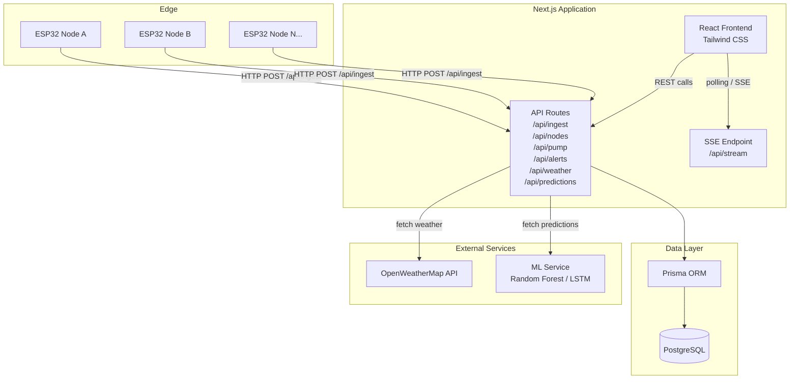

# Design Document

## AquaSense — Smart Irrigation & Soil Monitoring System

---

## Overview

AquaSense is a full-stack IoT dashboard built on Next.js that bridges a physical ESP32-based sensor network with a web interface for real-time monitoring, historical analysis, automated irrigation control, and ML-driven forecasting.

The system has three physical tiers:

1. **Edge layer** — ESP32 nodes reading soil moisture, temperature/humidity (DHT-11), water reservoir level (HC-SR04), and pH. Each node POSTs readings to the API on a configurable interval.
2. **Application layer** — Next.js app serving both the React frontend and API routes. Prisma ORM mediates all database access against PostgreSQL.
3. **External services** — OpenWeatherMap for weather forecasts; a Python ML service (Random Forest / LSTM) for irrigation peak predictions.

The dashboard supports multiple sensor nodes (zones), configurable alert thresholds, manual and automated pump control, and a full audit trail of pump events and alerts.

---

## Architecture



### Key Architectural Decisions

- **Polling vs SSE**: The dashboard uses Server-Sent Events (SSE) for live sensor data push. The SSE endpoint queries the DB for readings newer than the last event ID and streams them. This avoids WebSocket complexity while still being push-based from the server's perspective. Clients fall back to 10-second polling if SSE is unsupported.
- **Weather caching**: Weather data is fetched from OpenWeatherMap at most every 30 minutes. The result is cached in the DB (`WeatherCache` table) so the API can serve stale data if the external service is down.
- **ML service decoupling**: The ML service is a separate process (Python). The Next.js API calls it via HTTP and caches the latest prediction in the DB. If the ML service is unreachable, the last cached prediction is returned with a staleness flag.
- **API key auth for ESP32**: Each registered sensor node has a hashed API key stored in the DB. The ESP32 sends the key in the `X-API-Key` header. The API validates it before persisting any reading.
- **Aggregation strategy**: Readings are stored at full resolution. Historical queries for ranges > 48 hours use a SQL `date_trunc('hour', ...)` GROUP BY to return hourly aggregates; ranges ≤ 48 hours return per-minute aggregates.

---

## Components and Interfaces

### API Routes

| Route | Method | Auth | Description |
|---|---|---|---|
| `/api/ingest` | POST | API Key | ESP32 submits a sensor reading |
| `/api/nodes` | GET | Session | List all registered sensor nodes |
| `/api/nodes` | POST | Session | Register a new sensor node |
| `/api/nodes/[id]` | PATCH | Session | Update node name/zone/status |
| `/api/nodes/[id]/readings` | GET | Session | Historical readings for a node |
| `/api/nodes/[id]/latest` | GET | Session | Latest reading for a node |
| `/api/pump` | GET | Session | Current pump state |
| `/api/pump` | POST | Session | Manual pump command (on/off) |
| `/api/pump/auto` | PATCH | Session | Toggle automated pump logic |
| `/api/alerts` | GET | Session | Alert history |
| `/api/alerts/[id]/ack` | POST | Session | Acknowledge an alert |
| `/api/alerts/thresholds` | GET/PUT | Session | Read/write threshold config |
| `/api/weather` | GET | Session | Current weather + 24h forecast |
| `/api/predictions` | GET | Session | Latest ML predictions |
| `/api/stream` | GET | Session | SSE stream for live updates |

### Frontend Components

```
app/
  dashboard/
    page.tsx                  # Main dashboard layout
    components/
      NodeStatusGrid.tsx       # Grid of all node status cards
      SensorCard.tsx           # Single node live readings card
      PumpControlPanel.tsx     # Manual + auto pump controls
      WeatherWidget.tsx        # Current weather + forecast
      PredictionPanel.tsx      # ML predictions display
      AlertBanner.tsx          # Active alert notifications
      AlertHistoryTable.tsx    # Paginated alert log
  nodes/
    [id]/
      page.tsx                 # Per-node detail view
      components/
        TimeSeriesChart.tsx    # Recharts wrapper for sensor trends
        TimeRangePicker.tsx    # 24h / 7d / 30d / custom selector
  settings/
    page.tsx                   # Threshold config + node management
```

### ESP32 Payload Contract

The ESP32 sends a JSON body to `POST /api/ingest`:

```json
{
  "nodeId": "node-uuid-or-slug",
  "timestamp": "2024-07-15T08:30:00Z",
  "soilMoisture": 42.5,
  "temperature": 28.3,
  "humidity": 65.1,
  "reservoirLevel": 18.4,
  "ph": 6.8
}
```

Header: `X-API-Key: <node-api-key>`

### SSE Stream Event Shape

```json
{
  "type": "reading",
  "nodeId": "node-uuid",
  "data": { ...SensorReading },
  "ts": "2024-07-15T08:30:05Z"
}
```

Event types: `reading`, `alert`, `pump_state`, `prediction`.

---

## Data Models

### Prisma Schema

```prisma
model SensorNode {
  id            String          @id @default(cuid())
  slug          String          @unique
  name          String
  zone          String?
  location      String?
  apiKeyHash    String
  isActive      Boolean         @default(true)
  createdAt     DateTime        @default(now())
  updatedAt     DateTime        @updatedAt

  readings      SensorReading[]
  alerts        Alert[]
  thresholds    Threshold[]
  pumpEvents    PumpEvent[]
}

model SensorReading {
  id              String      @id @default(cuid())
  nodeId          String
  node            SensorNode  @relation(fields: [nodeId], references: [id])
  timestamp       DateTime
  soilMoisture    Float       // % volumetric water content
  temperature     Float       // °C
  humidity        Float       // % relative humidity
  reservoirLevel  Float       // cm distance from sensor
  ph              Float       // pH 0–14

  @@index([nodeId, timestamp])
}

model PumpEvent {
  id          String      @id @default(cuid())
  nodeId      String?
  node        SensorNode? @relation(fields: [nodeId], references: [id])
  source      String      // "manual" | "automated"
  action      String      // "on" | "off"
  triggeredBy String?     // userId or "system"
  timestamp   DateTime    @default(now())
  success     Boolean
  errorMsg    String?
}

model Alert {
  id            String      @id @default(cuid())
  nodeId        String
  node          SensorNode  @relation(fields: [nodeId], references: [id])
  metric        String      // "soilMoisture" | "temperature" | ...
  breachValue   Float
  thresholdValue Float
  direction     String      // "above" | "below"
  acknowledged  Boolean     @default(false)
  acknowledgedAt DateTime?
  createdAt     DateTime    @default(now())

  @@index([nodeId, createdAt])
}

model Threshold {
  id        String      @id @default(cuid())
  nodeId    String?     // null = global default
  node      SensorNode? @relation(fields: [nodeId], references: [id])
  metric    String
  minValue  Float?
  maxValue  Float?
  updatedAt DateTime    @updatedAt
}

model WeatherCache {
  id          String    @id @default(cuid())
  fetchedAt   DateTime  @default(now())
  isStale     Boolean   @default(false)
  data        Json      // raw OpenWeatherMap response
}

model MLPrediction {
  id              String    @id @default(cuid())
  generatedAt     DateTime  @default(now())
  horizon         String    // "24h" | "7d"
  predictions     Json      // array of { timestamp, probability, confidence }
  inputFeatures   Json      // snapshot of features used
  isStale         Boolean   @default(false)
}
```

### Sensor Value Ranges

| Metric | Min | Max | Unit |
|---|---|---|---|
| soilMoisture | 0 | 100 | % |
| temperature | -40 | 80 | °C |
| humidity | 0 | 100 | % |
| reservoirLevel | 0 | 400 | cm |
| ph | 0 | 14 | pH |

These ranges are used for both ingestion validation and threshold configuration validation.


---

## Correctness Properties

*A property is a characteristic or behavior that should hold true across all valid executions of a system — essentially, a formal statement about what the system should do. Properties serve as the bridge between human-readable specifications and machine-verifiable correctness guarantees.*

### Property 1: Node Offline Detection

*For any* sensor node and any last-reported timestamp, the node status computation function should return `"offline"` if and only if the timestamp is more than 5 minutes before the current time.

**Validates: Requirements 1.3**

---

### Property 2: Time Range Filtering Correctness

*For any* list of sensor readings and any selected time range `[start, end]`, the filtered result should contain exactly those readings whose timestamps fall within `[start, end]` — no readings outside the range, and no readings inside the range omitted.

**Validates: Requirements 2.2**

---

### Property 3: Aggregation Granularity Selection

*For any* time range duration, the aggregation granularity selector should return `"hour"` if the duration exceeds 48 hours, and `"minute"` if the duration is 48 hours or less.

**Validates: Requirements 2.3**

---

### Property 4: Auto-Pump Decision Logic

*For any* set of active node soil moisture readings and any weather forecast, the automated pump activation function should return `true` if and only if all moisture readings are below the configured threshold AND the forecast contains no rain within the next 24 hours. In particular, if rain is forecast within 24 hours, the function must return `false` regardless of moisture values.

**Validates: Requirements 3.4, 3.5**

---

### Property 5: Pump Panel Rendering Completeness

*For any* active pump event object, the rendered pump control panel should include the current pump state, the activation source (manual or automated), and the elapsed run time.

**Validates: Requirements 3.3**

---

### Property 6: Weather Widget Rendering Completeness

*For any* weather data object returned by the Weather_Service, the rendered weather widget should include current temperature, humidity, wind speed, precipitation, the 24-hour rain forecast with probability and amount, and the timestamp of the last successful fetch.

**Validates: Requirements 4.1, 4.2, 4.5**

---

### Property 7: Weather Cache Staleness Check

*For any* cached weather entry, the staleness check function should return `true` (stale) if and only if the entry's `fetchedAt` timestamp is more than 30 minutes before the current time.

**Validates: Requirements 4.3**

---

### Property 8: Prediction Panel Rendering Completeness

*For any* ML prediction object, the rendered prediction panel should include predictions for both the 24-hour and 7-day horizons, the confidence score for each prediction, and the input features used to generate the prediction.

**Validates: Requirements 5.1, 5.3, 5.4**

---

### Property 9: ML Prediction Persistence Round-Trip

*For any* valid ML prediction object, saving it to the Data_Store and then retrieving it should produce an object equivalent to the original, including the generation timestamp and all prediction entries.

**Validates: Requirements 5.6**

---

### Property 10: Node Registration and Update Round-Trip

*For any* valid node registration payload (identifier, location, sensor config, name, zone), registering the node and then retrieving it should return a node record whose fields match the submitted values. Similarly, after updating a node's name or zone label, retrieving the node should reflect the updated values.

**Validates: Requirements 6.3, 6.5**

---

### Property 11: Decommissioned Node Exclusion

*For any* active sensor node, after decommissioning it, the node should not appear in the active node list returned by the API, but all of its historical readings should remain retrievable via the node's readings endpoint.

**Validates: Requirements 6.6**

---

### Property 12: Threshold Breach Detection

*For any* sensor reading and any threshold configuration, the alert evaluation function should create an alert record if and only if the reading's value for a given metric is outside the configured `[minValue, maxValue]` range for that metric on that node (or the global default if no node-specific threshold exists).

**Validates: Requirements 7.1, 7.2**

---

### Property 13: Alert History Rendering Completeness

*For any* alert record, the rendered alert history row should include the alert type (metric), the affected sensor node identifier, the breach value, the threshold value, and the timestamp.

**Validates: Requirements 7.3**

---

### Property 14: Alert Acknowledgement State Transition

*For any* unacknowledged alert, after a farmer acknowledges it, retrieving the alert from the Data_Store should return `acknowledged: true` and a non-null `acknowledgedAt` timestamp.

**Validates: Requirements 7.4**

---

### Property 15: Threshold Configuration Round-Trip

*For any* valid threshold configuration (metric, minValue, maxValue, nodeId or global), saving the threshold and then retrieving it should return a threshold record whose fields match the submitted values.

**Validates: Requirements 7.5**

---

### Property 16: Threshold Validation Rejects Out-of-Range Values

*For any* threshold configuration update where `minValue` or `maxValue` falls outside the valid sensor range for that metric (as defined in the sensor value ranges table), the validation function should reject the update and return a descriptive error identifying the invalid field and the valid range.

**Validates: Requirements 7.7**

---

### Property 17: Sensor Reading Ingestion Round-Trip

*For any* valid sensor reading object (soilMoisture, temperature, humidity, reservoirLevel, ph), submitting it to `POST /api/ingest` and then retrieving the latest reading for that node should return an object with field values equivalent to the original, with no loss of floating-point precision beyond what PostgreSQL's `double precision` type guarantees.

**Validates: Requirements 8.2, 9.3, 9.4**

---

### Property 18: Ingestion Validation Rejects Invalid Payloads

*For any* sensor reading payload that is missing one or more required fields (nodeId, timestamp, soilMoisture, temperature, humidity, reservoirLevel, ph) or contains a value outside the valid sensor range for any metric, the ingestion endpoint should return HTTP 400 with a field-level error message identifying each invalid or missing field.

**Validates: Requirements 8.3**

---

### Property 19: API Key Authentication

*For any* request to `POST /api/ingest`, the endpoint should return HTTP 401 if the `X-API-Key` header is absent, does not match any registered node's key, or corresponds to a node whose identifier does not match the submitted `nodeId`.

**Validates: Requirements 8.4, 8.5**

---

## Error Handling

### Ingestion Errors

| Condition | HTTP Status | Response |
|---|---|---|
| Missing required field | 400 | `{ "error": "validation", "fields": { "<field>": "<reason>" } }` |
| Out-of-range sensor value | 400 | `{ "error": "validation", "fields": { "<field>": "value X out of range [min, max]" } }` |
| Invalid or missing API key | 401 | `{ "error": "unauthorized" }` |
| Unrecognized nodeId | 401 | `{ "error": "unauthorized" }` |
| DB write failure | 500 | `{ "error": "internal" }` |

### Pump Command Errors

- If the pump command HTTP call to the ESP32 times out or returns a non-2xx, the API records the event with `success: false` and `errorMsg` set to the failure reason, then returns HTTP 502 with a descriptive message.
- The dashboard displays the error message inline in the pump control panel.

### Weather Service Unavailability

- The API catches any fetch error from OpenWeatherMap and falls back to the most recent `WeatherCache` row.
- The response includes `"isStale": true` and the `fetchedAt` of the cached entry.
- If no cached entry exists, the API returns HTTP 503 with `{ "error": "weather_unavailable" }`.

### ML Service Unavailability

- The API catches any fetch error from the ML service and returns the most recent `MLPrediction` row with `isStale: true`.
- If no cached prediction exists, the API returns HTTP 503 with `{ "error": "predictions_unavailable" }`.

### Threshold Validation

- Before persisting any threshold update, the API validates that `minValue` and `maxValue` are within the sensor's defined range.
- Invalid values return HTTP 400 with field-level errors.
- `minValue` must be less than `maxValue` when both are provided.

### SSE Stream Errors

- If the DB query for new readings fails, the SSE endpoint sends an `event: error` frame and closes the connection.
- The client reconnects automatically using the browser's built-in SSE reconnection with exponential backoff.

---

## Testing Strategy

### Dual Testing Approach

Both unit tests and property-based tests are required. They are complementary:

- **Unit tests** cover specific examples, integration points, and error conditions.
- **Property-based tests** verify universal correctness across randomized inputs.

### Property-Based Testing

**Library**: [fast-check](https://github.com/dubzzz/fast-check) (TypeScript/JavaScript)

Each correctness property defined above must be implemented as a single property-based test using `fc.property(...)` with a minimum of **100 iterations** per test run.

Each test must include a comment tag in the following format:

```
// Feature: smart-irrigation-dashboard, Property <N>: <property_text>
```

Example:

```typescript
// Feature: smart-irrigation-dashboard, Property 4: Auto-Pump Decision Logic
it('auto-pump activates iff all moisture below threshold and no rain forecast', () => {
  fc.assert(
    fc.property(
      fc.array(fc.float({ min: 0, max: 100 }), { minLength: 1 }),
      fc.boolean(),
      fc.float({ min: 0, max: 100 }),
      (moistureReadings, rainForecast, threshold) => {
        const result = evaluateAutoPump(moistureReadings, rainForecast, threshold);
        const allBelowThreshold = moistureReadings.every(m => m < threshold);
        return result === (allBelowThreshold && !rainForecast);
      }
    ),
    { numRuns: 100 }
  );
});
```

### Property Test Coverage Map

| Property | Test File | fast-check Arbitraries |
|---|---|---|
| P1: Node offline detection | `lib/nodes.test.ts` | `fc.date()` for timestamps |
| P2: Time range filtering | `lib/readings.test.ts` | `fc.array(readingArb)`, `fc.date()` pairs |
| P3: Aggregation granularity | `lib/aggregation.test.ts` | `fc.integer()` for duration in minutes |
| P4: Auto-pump decision | `lib/pump.test.ts` | `fc.array(fc.float)`, `fc.boolean()`, `fc.float()` |
| P5: Pump panel rendering | `components/PumpControlPanel.test.tsx` | `pumpEventArb` |
| P6: Weather widget rendering | `components/WeatherWidget.test.tsx` | `weatherDataArb` |
| P7: Weather cache staleness | `lib/weather.test.ts` | `fc.date()` for fetchedAt |
| P8: Prediction panel rendering | `components/PredictionPanel.test.tsx` | `predictionArb` |
| P9: ML prediction round-trip | `lib/predictions.test.ts` | `mlPredictionArb` |
| P10: Node registration round-trip | `lib/nodes.test.ts` | `nodePayloadArb` |
| P11: Node decommission exclusion | `lib/nodes.test.ts` | `nodeArb` |
| P12: Threshold breach detection | `lib/alerts.test.ts` | `readingArb`, `thresholdArb` |
| P13: Alert history rendering | `components/AlertHistoryTable.test.tsx` | `alertArb` |
| P14: Alert acknowledgement | `lib/alerts.test.ts` | `alertArb` |
| P15: Threshold config round-trip | `lib/thresholds.test.ts` | `thresholdPayloadArb` |
| P16: Threshold validation | `lib/thresholds.test.ts` | `fc.float()` out-of-range values |
| P17: Ingestion round-trip | `api/ingest.test.ts` | `sensorReadingArb` |
| P18: Ingestion validation | `api/ingest.test.ts` | invalid payload arbitraries |
| P19: API key auth | `api/ingest.test.ts` | `fc.string()` for API keys |

### Unit Testing

**Framework**: Jest + React Testing Library

Unit tests should focus on:

- Specific examples that demonstrate correct behavior (e.g., a known sensor reading produces the expected alert)
- Integration points between components (e.g., `NodeStatusGrid` correctly passes node data to `SensorCard`)
- Error conditions and edge cases (e.g., empty readings list renders "no data" message, weather service 503 returns stale cache)
- API route handler integration tests using `next-test-api-route-handler` or MSW

Avoid writing unit tests that duplicate what property tests already cover across many inputs.

### Test File Structure

```
__tests__/
  lib/
    nodes.test.ts
    readings.test.ts
    aggregation.test.ts
    pump.test.ts
    weather.test.ts
    alerts.test.ts
    thresholds.test.ts
    predictions.test.ts
  api/
    ingest.test.ts
  components/
    PumpControlPanel.test.tsx
    WeatherWidget.test.tsx
    PredictionPanel.test.tsx
    AlertHistoryTable.test.tsx
    SensorCard.test.tsx
```
